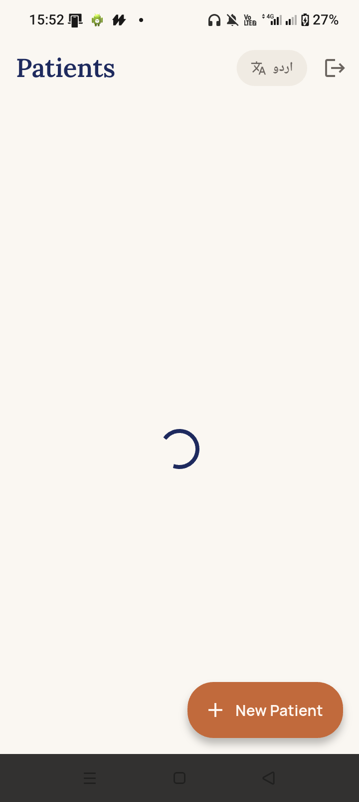
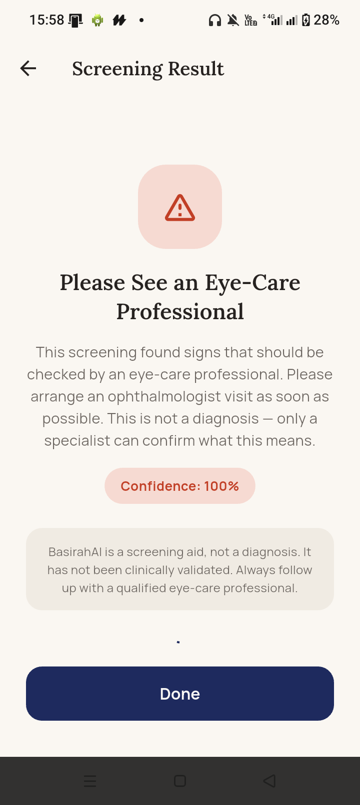
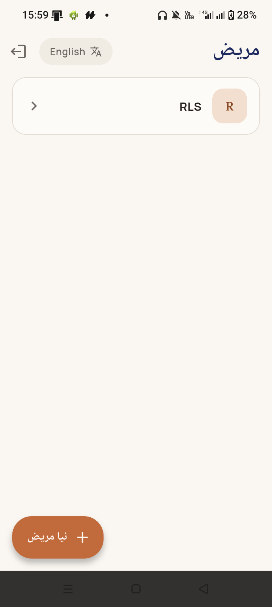

# BasirahAI

**AI-assisted diabetic retinopathy screening support for Pakistan.**

Built for the **Alibaba Cloud AI Hackathon Pakistan 2026** (Bano Qabil × Alibaba Cloud).

BasirahAI is a mobile screening-support tool: a health worker (or the patient themselves) captures or uploads a retinal fundus photo, and a pretrained AI model returns a **Referable / Non-Referable** result with a confidence score in seconds. Patient records and screening history are kept per authenticated user, in English or Urdu with full right-to-left layout.

**This is a screening/decision-support aid, not a diagnosis.** Every result says so, on-screen, every time.

<p align="center">
  
  
  
</p>

## Features

- **Authenticated accounts** with patient records (name, DOB, gender, optional CNIC/phone)
- **Screening capture** — camera or gallery upload, with upload-progress feedback and graceful handling of weak/interrupted connections
- **Real AI inference** — an existing, pretrained diabetic-retinopathy model (not trained by us, not a mock) returns a binary Referable/Non-Referable call plus a confidence score
- **Screening history** per patient, with retry-safe UI and immediate refresh after a new screening
- **English + Urdu**, including correct RTL mirroring, bidi-safe timestamps, and a persistent language toggle
- **Honest safety messaging** — confidence is always shown as "how sure this specific result is," never conflated with clinical accuracy; known limitations are disclosed rather than hidden

## Screenshots

All three screenshots above were captured from a real Android phone running the release build over real mobile data, not the emulator.

## Architecture

```
Flutter App ── auth / patients / history ──▶ Supabase (Postgres + Auth, RLS-scoped per user)
Flutter App ── HTTPS multipart upload ──▶ FastAPI /screen ──▶ pretrained DR model ──▶ result
                                                                                          │
                                                 Flutter writes the result to Supabase ◀──┘
```

The backend does one job — validate an image and return a screening result. It's stateless and holds no database of its own; auth, patient records, and history all go through Supabase directly from the Flutter app via Row-Level Security.

## Tech Stack

| Layer | Choice |
|---|---|
| Mobile app | Flutter (Dart), Android |
| HTTP client | `dio` (upload progress) |
| Auth / DB | Supabase (Postgres + Auth), via `supabase_flutter`, Row-Level Security |
| Inference backend | FastAPI (Python), Dockerized, one endpoint (`/screen`) |
| Model | [jdelgado2002/diabetic_retinopathy_detection](https://huggingface.co/jdelgado2002/diabetic_retinopathy_detection) — ResNet-50 via fastai, MIT license, trained on APTOS 2019 |
| Hosting | Railway (Docker) |
| Localization | `flutter_localizations` + `intl`, ARB files |

No on-device inference, no self-training — the phone never runs the model. See [`docs/ML_PLAN.md`](docs/ML_PLAN.md) for the model choice and licensing rationale.

## Model Evaluation — What the Numbers Actually Mean

We ran 201 real APTOS fundus images through the live deployed backend and measured our own accuracy, sensitivity, and specificity — see [`docs/EVALUATION_RESULTS.md`](docs/EVALUATION_RESULTS.md) for the full numbers and confusion matrix.

**Important caveat, stated plainly rather than glossed over:** that sample was drawn from APTOS's only publicly-labeled split, which the model almost certainly trained on — so our measured accuracy is a sanity check of the deployed pipeline's mechanics, not an unbiased, independent accuracy measurement. It is clearly distinguished in the docs from the model author's own self-reported validation accuracy. Neither number was measured on a Pakistani population.

## Known Limitations

- Not clinically validated; not tested on a Pakistani population
- The low-confidence display cutoff (0.6) is a documented placeholder, not empirically tuned
- MVP-level PII handling — this is a hackathon build, not a production clinical system
- No raw fundus photos are retained anywhere — only the numeric result is stored

## Getting Started

Backend setup and deployment: [`backend/README.md`](backend/README.md)
Database schema (Postgres + RLS policies): [`supabase/schema.sql`](supabase/schema.sql)

```bash
# Backend (local dev)
cd backend
source .venv/Scripts/activate
uvicorn app.main:app --reload --port 8000

# Flutter app
cd app
flutter build apk --release \
  --dart-define=SUPABASE_URL=<your-supabase-url> \
  --dart-define=SUPABASE_ANON_KEY=<your-supabase-anon-key>
```

## Project Structure

```
├── app/          Flutter mobile app
├── backend/      FastAPI inference service
├── supabase/     Postgres schema + Row-Level Security policies
└── docs/         Model provenance, evaluation results, safety copy, image pipeline spec
```

Deeper engineering documentation — architecture history, every bug found and fixed, exact reproduction steps, and day-by-day project status — lives in [`dev/HANDOFF.md`](dev/HANDOFF.md) and [`dev/plan.md`](dev/plan.md).

## License & Provenance

The integrated model is MIT-licensed by its original author (see [`docs/ML_PLAN.md`](docs/ML_PLAN.md) for full attribution). The APTOS 2019 dataset used for our independent evaluation is used under its Kaggle competition license (non-commercial/academic, no redistribution) — no dataset images are committed to this repository.
